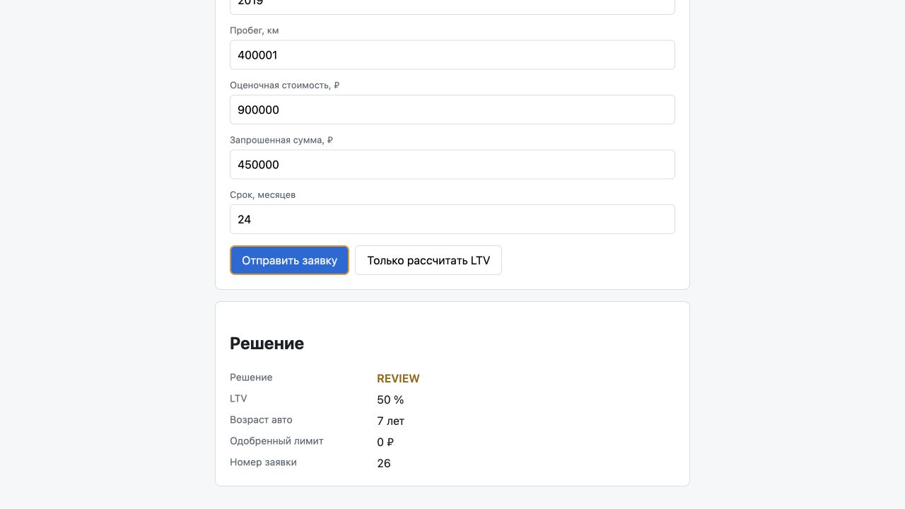

# E2E-проверка MILEAGE через Playwright

- Сервис запущен локально на `http://localhost:8081` (порт 8080 был занят).
- Во фронтенд-форме указаны: пробег `400001`, оценочная стоимость `900000`,
  запрошенная сумма `450000`; LTV равен `50%`.
- После отправки заявки интерфейс показал решение `review` и одобренный лимит
  `0 ₽`.

Проверка выполнена Playwright через браузерную сессию.
